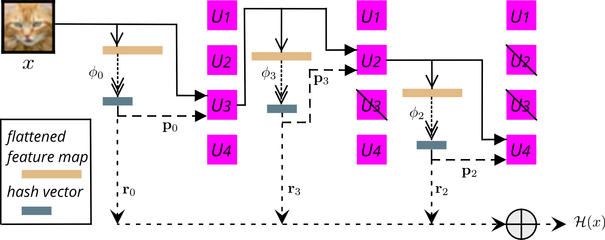

# Continual learning using hash-routed convolutional neural networks

## Description

This software package contains the code to run and evaluate HRN, based on the
 paper *Continual learning using hash-routed convolutional neural networks* 
 (<https://arxiv.org/abs/2010.05880>)

 

## 1- System requirements

This software package was developed and tested using the following
 configuration:
 
 Hardware: At least 8 GB of RAM and preferably a NVIDIA P100 GPU (tested
  using CUDA 10.1 and libcudnn7)
 
 OS: Tested on Ubuntu 18.04 LTS and 20.04 LTS
 
 Python: Tested using Python 3.7 (Anaconda3 2020.02)
 
## 2- Installation

The *requirements.txt* file contains *pip* dependencies needed to run the
 software.
 
 ```bash
 pip install -r requirements.txt
 ```

The software can also be installed as python package:

```bash
pip install -e hrn/
```

## 3- Training

If the software was not installed as python package, add the path to the
 *hrn* folder to PYTHONPATH.

Go into the software package root folder

```bash
cd hrn
```

To train a HRN, run:

```bash
python Scripts/training/training_s.py Scripts/conf/pmnist.yaml cpu
```

If your machine has one or more GPUs, you can run:

```bash
python Scripts/training/training_s.py Scripts/conf/pmnist.yaml cuda -d 0
```

(this selects GPU 0 for training)

The *Scripts/conf* folder contains YAML configuration files that can be used
 to describe the HRN and the scenarios to run.

## 4- Data analysis

This software uses MLflow (<https://mlflow.org/>) to log training metrics
. Running a training script will create the *hrn/mlruns* folder containing
 the MLflow database.
 Tensorboard can also be used to view realtime metrics. Logs can be found in
 the  created *../data* folder.
 
## Hyperparameters search

It is possible to search for optimal hyperparameters using HyperOpt and jinja2
. The generic yaml file is given as a jinja2 template (see *Scripts/conf/tiny
.yaml.j2* as an example). The generic fields exploration space is given in
 the python script (see *Scripts/hypertrain_tiny_s.py* as an example). The
  hyperparemeter search can be run as such:

```bash
python Scripts/training/hypertrain_tiny_s.py $(pwd)/Scripts/conf/ tiny.yaml.j2 cuda 0
```

The first parameter is the absolute path to the folder containing the jinja2
 template and the second parameter is the name of the template file.